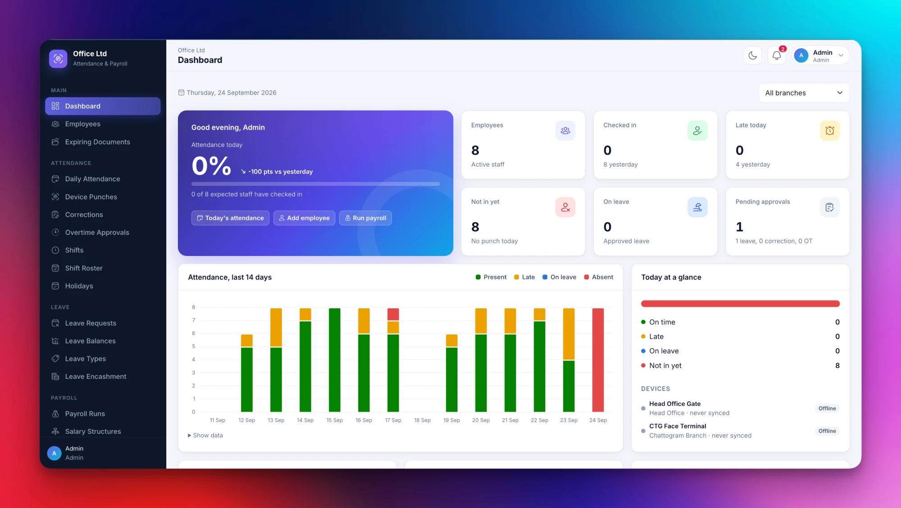

<div align="center">

# ZKTendance

**Attendance, leave and payroll management for offices that use ZKTeco biometric devices.**

Multi branch · Multi device · ADMS push and UDP pull · Shift roster · Overtime · Bangladesh income tax · PDF payslips

[](https://github.com/nayeemdev/zktendance/actions/workflows/tests.yml)


[Website](https://attendance.nayeem.me) · [Deployment guide](docs/deploy-cloudpanel.md) · [Report an issue](https://github.com/nayeemdev/zktendance/issues)

<br>



</div>

---

## Contents

- [Why ZKTendance](#why-zktendance)
- [Features](#features)
- [Tech stack](#tech-stack)
- [Quick start](#quick-start)
- [Connecting ZKTeco devices](#connecting-zkteco-devices)
- [Background jobs](#background-jobs)
- [Payroll workflow](#payroll-workflow)
- [Deployment](#deployment)
- [Project structure](#project-structure)
- [Testing](#testing)

## Why ZKTendance

ZKTeco terminals record punches, but turning those punches into attendance, leave balances and salaries is usually done by hand in spreadsheets. ZKTendance connects to your devices, builds daily attendance automatically and carries it all the way to approved payslips, with a self service portal for employees.

| | |
|---|---|
| **Works with your devices** | Push (ADMS / iClock) for cloud servers and pull (UDP 4370) for local networks, any number of devices per branch |
| **Attendance you can trust** | Late, early leave, half day, overtime, night shifts, weekends and holidays calculated from raw punches |
| **Payroll in minutes** | Salary structures, overtime rules, loans, bonuses and income tax turned into PDF payslips |
| **Built for teams** | Admin, HR, Branch Manager and Employee roles, approvals, notifications and a full audit log |

## Features

### Organisation
- First time setup wizard for company, country, currency (Bangladesh and BDT by default), timezone, main branch and the admin account
- Multiple branches, each with its own weekends, holidays, devices and overtime rule
- Departments, designations and employee profiles with private document storage and expiry tracking

### Devices
- Pull mode downloads punches every 5 minutes or on demand; push mode receives punches in real time
- Test connection, sync device time, restart, clear logs and send employees to a device
- Import users stored on a device as employees in one click, or link them to existing employees
- Unregistered devices that contact the server are listed so they can be added
- Offline alerts when a device stops responding

### Attendance
- Daily attendance built from punches: check in, check out, worked time, late, early leave, half day and absent
- Shifts with grace minutes, half day threshold, break time and support for overnight shifts
- Shift roster with date ranges and rotation for employees, branches or departments
- Manual attendance with a required reason, and employee correction requests with approval
- Overtime with rounding, daily caps and optional approval before it is paid

### Leave
- Leave types with yearly or monthly credit, carry forward, half days and male or female only types
- Balance and overlap checks, one or two step approval (manager recommends, HR approves)
- Approved leave updates attendance automatically; leave that crosses the new year is split between years
- Leave encashment paid through payroll

### Payroll
- Salary structures from components as a percentage of gross, a percentage of basic or a fixed amount
- Deductions for absence, unpaid leave and repeated late arrival; overtime at Bangladesh Labour Act rates by default
- Loans with monthly installments, one time bonuses and deductions, pro rata pay for joiners and leavers
- Income tax (TDS) with editable Bangladesh tax slabs
- Draft, approve and paid workflow with editable payslip lines while in draft
- PDF payslips, email delivery and Excel or CSV bank sheets

### Reports and insight
- Dashboard with attendance rate, 14 day trend, department check ins, late ranking and payroll trend
- Daily attendance, monthly summary, monthly attendance sheet and late and early leave reports
- Excel and CSV export for every report

### People and security
- Roles: **Admin**, **HR**, **Branch Manager** (one branch only) and **Employee**
- Employee portal: today's punches, monthly calendar, leave, corrections, payslips, documents and notices
- In app and email notifications for requests, approvals, payslips and device alerts
- Audit log of every sensitive change with old and new values, plus logins
- Password reset by email, light and dark mode, and a layout that works on phones

## Tech stack

| Layer | Technology |
|---|---|
| Backend | PHP 8.3+, Laravel 13 |
| Database | MySQL 8, MariaDB 10.6+ or SQLite (development and tests) |
| Frontend | Blade, Bootstrap 5, Chart.js, Hugeicons, Inter |
| Devices | `jmrashed/zkteco` (UDP pull) and a built in ADMS / iClock endpoint (push) |
| Documents | `barryvdh/laravel-dompdf` for PDF payslips, `openspout/openspout` for Excel |
| Jobs | Laravel scheduler and database queue |

## Quick start

**Requirements:** PHP 8.3+ with `sockets`, `pdo_mysql`, `mbstring`, `gd`, `zip` and `intl`, Composer, and MySQL or MariaDB.

```bash
git clone https://github.com/nayeemdev/zktendance.git
cd zktendance
composer install
cp .env.example .env
php artisan key:generate
```

Set your database in `.env`:

```env
DB_CONNECTION=mysql
DB_HOST=127.0.0.1
DB_PORT=3306
DB_DATABASE=zktendance
DB_USERNAME=root
DB_PASSWORD=
```

Create the tables and start the app:

```bash
php artisan migrate
php artisan storage:link
php artisan serve
```

Open `http://localhost:8000` and complete the setup wizard.

### Demo data

To explore the system with sample branches, employees, devices and a month of punches:

```bash
php artisan migrate:fresh --seed
```

| Role | Email | Password |
|---|---|---|
| Admin | admin@example.com | password |
| HR | hr@example.com | password |
| Employee | employee1@example.com | password |

> Do not run the seeder on a live server. It creates users with the password `password`.

## Connecting ZKTeco devices

Give every employee a **Device User ID** equal to their user ID (PIN) on the device, or import users from the device later.

| | Push (ADMS) | Pull (UDP 4370) |
|---|---|---|
| **Best for** | Cloud or VPS servers, remote branches | Servers inside the office network or over VPN |
| **Typical models** | SpeedFace, ProFace, SenseFace, MB560, UFace800 | K40, MB460, iFace, F18, X628 and most terminals |
| **Setup** | Register the serial number, then point **Comm > Cloud Server Setting** at your domain | Fixed IP, Comm Key `0`, then **Test Connection** |
| **Timing** | Real time | Every 5 minutes, or **Download Punches Now** |

Push devices call `https://your-domain/iclock/cdata`. Commands such as sending users, restarting and clearing logs are queued and delivered the next time the device checks in.

## Background jobs

Add the scheduler to cron:

```cron
* * * * * cd /path/to/zktendance && php artisan schedule:run >> /dev/null 2>&1
```

| Command | Schedule | Purpose |
|---|---|---|
| `zk:sync` | Every 5 minutes | Download punches from pull mode devices |
| `attendance:process` | Every 15 minutes | Build attendance for yesterday and today |
| `devices:check` | Every 10 minutes | Alert admins when a device stops responding |
| `leave:allocate` | 1st of each month | Create balances, carry forward and add monthly credits |

Keep a queue worker running for emails:

```bash
php artisan queue:work
```

Commands can also be run by hand, for example `php artisan attendance:process 2026-08-01 2026-08-31`.

## Payroll workflow

1. Sync punches and approve pending leave, corrections and overtime
2. Add one time bonuses or deductions for the month
3. **Payroll Runs > Run Payroll** to create a draft for all branches or one branch
4. Review, edit payslip lines or **Regenerate** as needed
5. **Approve** to record loan installments, publish payslips and email them
6. **Mark as Paid** after the bank transfer and export the bank sheet

Income tax slabs are seeded with the Bangladesh slabs for FY 2026-27. Review them against the current Finance Act in **Settings**.

## Deployment

A complete production guide for CloudPanel, covering SSL, cron, the queue worker, push and pull device setup, updates, backups and troubleshooting, is in **[docs/deploy-cloudpanel.md](docs/deploy-cloudpanel.md)**.

Updating an existing installation:

```bash
git pull origin main
composer install --no-dev --optimize-autoloader
php artisan migrate --force
php artisan optimize
php artisan queue:restart
```

## Project structure

The code follows a plain Laravel flow: **route, controller, form request, service, model, view**.

```
app/
├── Http/
│   ├── Controllers/Admin        Admin, HR and manager screens
│   ├── Controllers/Portal       Employee portal
│   ├── Controllers/AdmsController.php   ZKTeco push endpoint (/iclock/*)
│   └── Requests                 Validation
├── Services                     Attendance, leave, payroll, tax, devices, reports
├── Services/Device              ZKTeco pull client behind the DeviceClient interface
├── Notifications                In app and email notifications
└── Models
resources/views                  Blade views
routes/web.php                   Web routes
routes/adms.php                  Device push routes
routes/console.php               Schedule
docs/                            Deployment guide and images
```

## Testing

```bash
php artisan test
```

The feature suite covers setup, devices (push and pull), attendance rules, leave, roster, overtime, payroll, tax, exports, notifications, roles and every page. GitHub Actions runs it on MySQL and SQLite for each pull request.
